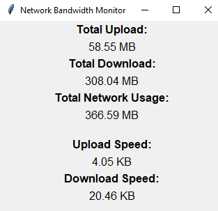

# Network Bandwidth Monitor



## Overview

The Network Bandwidth Monitor is a Python program that allows you to monitor your network bandwidth usage and display various network statistics in a graphical user interface (GUI). It uses the Tkinter library for creating the GUI and the Scapy library for capturing network packets.

**Original Creator:** [waterrmalann](https://github.com/waterrmalann)

## Features

- Real-time monitoring of total upload and download data
- Display of current upload and download speeds
- Calculation and display of total network usage
- Customizable refresh interval for updating statistics

## Requirements

- Python 3.x
- Tkinter library (usually included with Python)
- Scapy library (to capture network packets)
- Psutil library (to gather network I/O counters)

## Installation and Usage

1. Clone the repository or download the source code.
2. Install the required Python libraries by running:
   ```
   pip install scapy psutil
   ```
3. Run the program by executing the `bandwidth_monitor.py` script:
   ```
   python bandwidth_monitor.py
   ```
4. The GUI window will open, displaying network statistics in real-time.
5. To exit the program, simply close the GUI window.

## Customization

You can customize the program by modifying the script. For example:

- Adjust the `REFRESH_DELAY` constant to change the update interval.
- Implement the `process_packet(packet)` function to add packet processing logic.

## License

This program is open-source and distributed under the [MIT License](LICENSE).

## Disclaimer

Please note that this program is provided as-is and may not cover all use cases or scenarios. Use it at your own risk. The program may require additional configuration or customization based on your specific requirements.

## Credits

Original Program: [waterrmalann/Network-Bandwidth-Monitor](https://github.com/waterrmalann/NetworkBandwidthMonitor)
