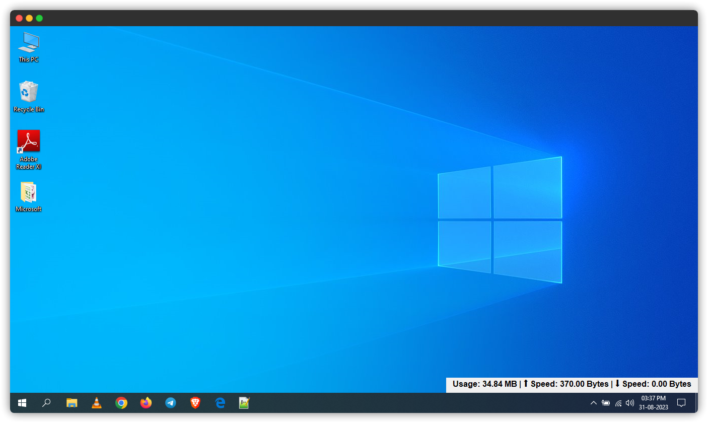

# Network Bandwidth Monitor

A simple network bandwidth monitor that displays current network usage and speeds.
<br>
This project is based on the original work by [Waterrmalann](#credits), with modifications to provide a more compact and user-friendly interface.

## Table of Contents

- [Description](#description)
- [Features](#features)
- [Getting Started](#getting-started)
  - [Prerequisites](#prerequisites)
  - [Installation](#installation)
- [Usage](#usage)
- [Automatic Startup](#automatic-startup)
- [Credits](#credits)
- [License](#license)

## Description

The Network Bandwidth Monitor is a Python-based program that allows you to monitor your network usage, upload speed, and download speed in real-time. The program creates a small window on your screen that displays this information in a concise and user-friendly format.

## Features

- Real-time monitoring of network usage, upload speed, and download speed.
- Compact and non-intrusive interface that can be placed anywhere on the screen.
- Automatic startup option to launch the program on computer boot.

## Getting Started

### Prerequisites

- Python 3.x installed on your system.
- `psutil` library installed. You can install it using the following command:
  ```
  pip install psutil
  ```

### Installation

1. Clone or download this repository to your local machine.
2. Navigate to the project directory:
   ```
   cd network_monitor
   ```
3. Save the `network_monitor.py` file with a `.pyw` extension. This prevents the console window from opening when the program is launched.
4. Create an executable (.exe) file using PyInstaller:
   ```
   pyinstaller --onefile network_monitor.pyw
   ```
5. A `dist` directory will be created containing the executable file.
6. To run the program, double-click the generated `network_monitor.exe` file.

## Usage

1. Run the program as described in the [Installation](#installation) section.
2. The monitor window will display current network usage, upload speed, and download speed.
3. To close the program, simply close the monitor window.

## Automatic Startup

To automatically start the Network Bandwidth Monitor when your computer boots up:

1. Create a shortcut of the `network_monitor.exe` file.
2. Paste the shortcut into the Startup folder (C:\ProgramData\Microsoft\Windows\Start Menu\Programs\StartUp).
3. The program will now start automatically every time your computer starts.

## Credits

This project is based on the original work by [Waterrmalann](https://github.com/waterrmalann). The original version of the program can be found [here](https://github.com/waterrmalann/NetworkBandwidthMonitor).

## License

This project is licensed under the MIT License - see the [LICENSE](LICENSE) file for details.
